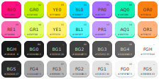

= Fern's Dotfiles
:url-arch: http://archlinux.org
:url-debs: http://www.debian.org
:url-gent: http://www.gentoo.org

Heyo! This is Fern, and these are my dotfiles.

My configuration is mostly meant to work on {url-gent}[Gentoo Linux],
and I make no guarantees of it working on anything else, though
I try keeping it compatible with {url-arch}[Arch], {url-debs}[Debian],
and sometimes with MacOS and the BSDs when it's possible
(and when I feel like it).

== Featuring!

Every folder on the root of this repository corresponds to a program
I actively use (unless I really don't and I've forgotten to delete it).
But realistically, the ones you probably care the most about are
Emacs, the text editor; Openbox, the window manager; and Zsh, the shell.

Oh, and if you're looking for (N)Vi(m) configs, sorry, here ain't it.
I know Vi enough to use it while SSHing, but I don't really like
using it as my local editor unless I really have to.

=== Emacs
:url-macs: http://www.gnu.org/software/emacs/
:url-ed:   http://www.gnu.org/fun/jokes/ed-msg.html

It may not be the {url-ed}[standard text editor],
but {url-macs}[Emacs] is _my_ editor.

My Emacs is set up to install all its packages on launch,
so there's no need to worry bout that. Unless a slow first launch
really bothers you that much.

[source, sh]
----
emerge -a app-editors/emacs
----

See its link:emacs/.config/emacs[configuration directory] for more
(and more, and more parentheses).

=== Openbox
:url-obox: http://openbox.org

The first window manager I tried, and probably the last one I'll use.
No matter what I do, or what other managers I try, I always come back
to {url-obox}[Openbox].

Despite the fact it has no IPC or scripting capabilities whatsoever,
and doing something as simple as popping up a menu requires you to
simulate key presses to do, Openbox remains one of the comfiest and
most featureful floating window managers I know of.

[source, sh]
----
emerge -a x11-wm/openbox
----

Might eventually replace it with Awesome if I ever manage to get its
floating mode to that same level of polish.

==== Dependencies

As mentioned, Openbox manages windows, processes key bindings,
and little else, so I use a good bunch of programs to add what I'd
consider to be basic functionality.
Here I'm only gonna list the ones that I consider necessary for my
destkop to launch correctly.
Don't really mind if the weather widget doesn't work on first launch
or whatever.

Polybar::
Think the common choice for an Openbox status bar is probably Tint2,
but I don't care for window buttons, and I love having scriped widgets
for everything. Including weather, news, and probably more.

[source, sh]
----
emerge -a x11-misc/polybar
----

Rofi::
It advertises itself as a window switcher, but in reality,
it's a very fanciful general purpose menu and application launcher,
so I use it for a lot of things, including the app menu, and the
log out screen.

[source, sh]
----
emerge -a x11-misc/rofi
----

S6 and Execline::
Most people seem content with just writing something like `picom &` in
their `autostart` file, but I prefer using actual process supervision,
cause it makes it easy to start and stop programs without having to
`pgrep` for the right process id.

I used to use `runit` for this, but S6 is readily available on Gentoo,
Debian, and Guix. So Arch, what's your problem?

[source, sh]
----
emerge -a sys-apps/s6
----

=== Zsh
:url-zsh:  http://www.zsh.org

The patrician's choice of shell.

Even if Bash is not as barebones as it once was,
and Fish includes a lot of convenient nice-to-haves by default,
{url-zsh}[Zsh] might remain as the most powerful among them,
with its great completion system, and globbing far more complex than
what's probably reasonable.

Though I haven't tried any of the weird non-POSIX shells,
like Elvish, Xonsh, or whatever.
I might be willing to suffer daily-driving Gentoo,
but using these sounds like a bit too much.

[source, sh]
----
emerge -a app-shells/zsh
----

Take a look at its link:emacs/.config/emacs[config files] if you wanna
see how I refuse using a plugin manager for no real reason.

== Colour Scheme

A lot of people would just tell you they use Gruvbox, Catppuccin,
or some other pre-made theme, but using a colour scheme made by
someone else only works when you're a style-blind Unix nerd who
can't tell the difference between cyan and teal.

So, to effectively flex on the geeks, I decided to pick my own colours.
Such a rebel.

I call it Kins, to have something to put on theme file names,
and it's mostly composed out of bold, eye-bleeding colours I like.
It can, and will, change randomly at my whim, whenever I feel that
I don't quite like any of the colours anymore, but can probably
count on it staying bright and neonish.

== Fonts
:url-hwei: http://developer.huawei.com/consumer/cn/design/resource/
:url-kins: http://github.com/fernzi/iosevkins
:url-mdi:  http://pictogrammers.com/docs/library/mdi/getting-started/webfont/

My favourite UI typeface right now is probably HarmonyOS Sans.
I love geometric fonts, and this one's subtle enough to use anywhere.
Not sure I'm allowed to redistribute it, but you can get it for free
at {url-hwei}[Huawei's site], on the very first link.

For Emacs and the terminal, I'm using a custom version of Iosevka,
which I call Iosevkins (original font, do not steal).
This one you can download at my {url-kins}[other repo].

For status icons, I like using the Material Design Icons web font.
You can download it from {url-mdi}[their CDN] and set it as fallback
on FontConfig (instead of using Nerd Fonts like a regarded individual).

== Installation
:url-git:  http://git-scm.com
:url-guix: http://guix.gnu.org
:url-nix:  http://nixos.org
:url-stow: http://www.gnu.org/software/stow
:url-xstw: http://sourceforge.net/projects/xstow

For the time being, my config files are managed with {url-stow}[Stow]
(or {url-xstw}[XStow], which is what I use, for no particular reason).
So you should probably install it with your package manager of choice,
along with {url-git}[Git], for convenience:

[source, sh]
----
# For Gentoo (press F for Funtoo):
emerge -a app-admin/stow dev-vcs/git

# For Debian, Ubuntu, Mint, and frens:
apt install stow git

# For Arch Linux, Endeavour, Manjaro, and so on:
pacman -S stow git

# For the Mac weirdos:
brew install stow git

# There might be a way to do it on Windows,
# but can only wonder why'd you even want to.
----

Each folder in the repository is a Stow package containing dotfiles
for one program, so after cloning it to your computer with Git,
you can run Stow from the working tree to install them into
your home. For example

[source, sh]
----
# Let's clone the best repo ever to somewhere convenient:
git clone http://github.com/fernzi/dotfiles.git ~/settings

# And install a package with Stow:
cd ~/settings
stow -v -d ~ emacs
----

would link my Emacs configuration into your home directory,
printing all the links it made into the terminal, for clarity's sake.

Expect this whole process to change eventually though, cause
I've been eyeing {url-nix}[Nix] and {url-guix}[Guix] for a while,
and might eventually be tempted into using Guix Home, or whatever
the Nix equivalent is called (but most likely Guix Home).

That said, I recommend against using my dotfiles as is, mostly cause
I don't care for making it easy to do so.
Expect me to randomly force-push commits, remove the files for programs
I no longer use, and rewrite scripts from Python, to Perl, to Ruby,
to Scheme for funsies and without warning.
